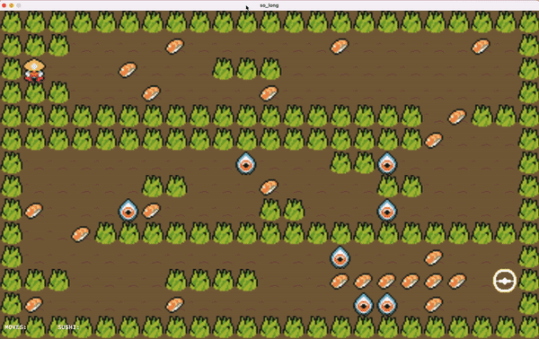

# so_long
This project is a very small 2D game. Its purpose is to make you work with textures, sprites, and some other very basic gameplay elements.

## how to run

```
make
```
valid maps are from map1 to map6
```
./so_long maps/map6.ber 
```


